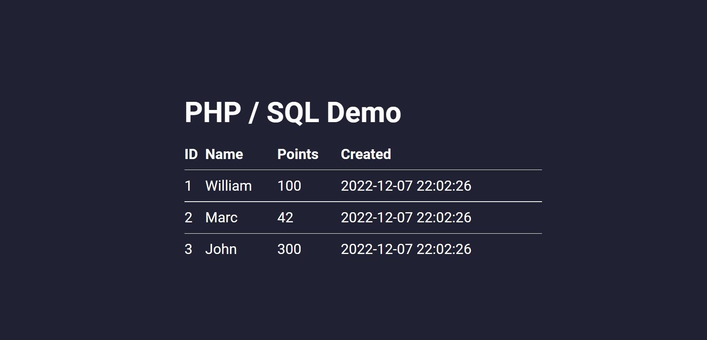

# Docker Setup for PHPMyAdmin with MariaDB

If you follow this installation guide, you should have an ready to go instance of XAMPP running via docker. This is especially useful, because you can simply redeploy the container to reset the whole installation which may got obscured to to bugs.

## Requirements

Before you can start the instance, you need to have docker installed. Just download Docker Desktop on the official docker site: [https://www.docker.com/](https://www.docker.com/) and install it. Afterwards restart your pc and everything should be set up now.

This repository contains scripts provided via [Taskfile](https://taskfile.dev/installation/). It's not necessary to use this tool, but it gives provides a nice productivity boost if used correctly. If you don't want to use / install it, you can look into the `Taskfile.yml` file, and simply copy the corresponding commands into your command line.

## Starting the instance

The Taskfile provides some useful scripts to start and stop the docker instances:

| command | effect|
|---------------|---------------------------------------------------|
| `task start`  | Starts up the whole docker instances.             |
| `task remove` | Stops and removes the instances of the system     | 

## Development

After starting the docker-compose instance everything should be up and running. You can now visit `http://localhost:8000` for the phpMyAdmin interface and `http://localhost:8001` for the demo website.

You can edit the `dump/db.sql` file to provide a startup script for the MariaDB instance. 

The `www` folder is getting provided via php apache server. So feel free to develop your fullstack application there. 

## License
Distributed under the MIT License, see the [LICENSE](./LICENSE) file for more information.